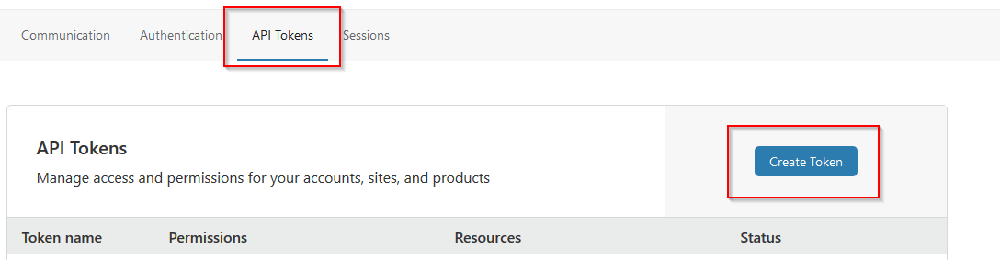
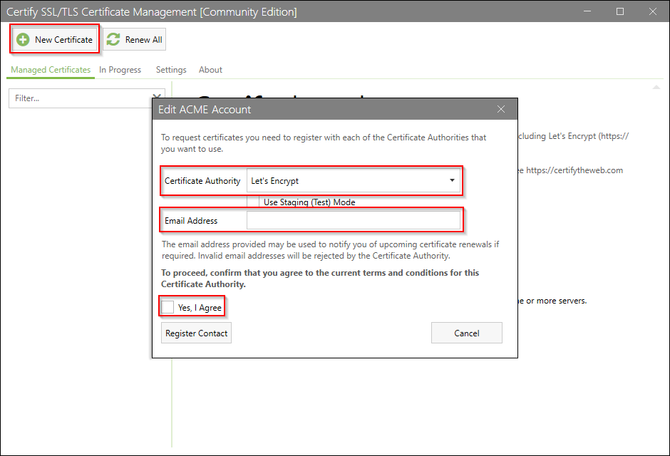

# Automated Certificate Renewal on Fortigate Firewalls

### Prerequisites
- DNS is hosted with one of the following providers: [docs.certifytheweb.com/docs/dns/validation](https://docs.certifytheweb.com/docs/dns/validation#dns-api-providers). This guide will cover setup with Cloudflare. Refer to CertifyTheWeb's documentation for setup with other providers.
- A server that you can run the CertifyTheWeb service on.
- That same server will need access to the Fortigate firewall via HTTPS.

## Save and Edit Script
1. Download the script that will perform the automated certificate renewal from Github to the workstation/server that you will run the script and renewal process from.

       Invoke-RestMethod -Method Get `
       -Uri "https://raw.githubusercontent.com/KSMC-TS/letsencrypt-scripts/main/certify/Install-LECertify-Fortigate.ps1" `
       -OutFile "C:\Scripts\Install-LECertify-Fortigate.ps1"
2. Edit the script to update the `$fortigateAddress` variable to the FQDN or IP address used to access the Fortigate firewall.
3. Edit the script to update the `$fortigateAdminPort` variable to the port used to access the web interface of the admin page.
4. Edit the script to update the `$encryptedToken` to the path to the encrypted API token file (creating this file will be covered).
5. Save the changes to the script.

## Install and Configure Certify The Web
1. Download and install Certify The Web on the server you will be running the script on. Certify The Web can be downloaded [here](https://certifytheweb.com/home/download).
2. Login to Cloudflare and navigate to **My Profile**.  
3. Select **API Tokens** and then **Create Token**.  
4. Leverage the API token templates to create a template for **Edit zone DNS**.
5. Edit the **Token name**, **Permissions**, **Zone Resources**, **IP Address Filtering**, and **TTL** appropriately. Limit the zone to the specific DNS zone and limit the IP address to the public address of the server you will be running CertifyTheWeb from.  
6. Validate the options and **Create Token**.
7. Save the API token created for use with CertifyTheWeb in the coming steps. This will only be shown once so make sure to copy it but protect this token as it grants anyone with access permission to make DNS changes within the permissions set earlier.  
8. Lauch Certify The Web and create a **New Certificate**. Choose Let's Encrypt as the Certificate Authority and an email to receive certificate related notifications at.  
9. Choose a name for the certificate, then **Add domains to certificate**. Once all the appropriate domains have been added, you can continue on to **Authorization**.  
10. Select **dns-01** for the **Challenge Type**. Select the **DNS Update Method**. For this example, we'll be using Cloudflare. Select **New** on the credentials field.  
11. Choose a **Credential Name** and enter the **API Token**.  
12. Back on Cloudflare, navigate to the domain's **Overview** page and scroll down to the API field on the right. Copy the **Zone ID** and paste into the **DNS Zone Id** field in Certify The Web.  
13. Within Certify The Web, you can move to the **Deployment** section and select **Deployment Tasks**. Under this section, select **Add** to configure the post-deployment Powershell script.  
14. Select **Run Powershell Script**.
15. On the next page, the **General Settings** as the defaults will work. Select **Task Parameters** and enter the path to the script saved from Github in the earlier section.  
16. Click **Save** on the new certificate dialog.

## Create Fortigate API Token
1. Login to the Fortigate and navigate to **System**, then **Admin Profiles**.
2. Create a new profile with **Read/Write** access to the **System** and **VPN**. Save this profile.  
3. Navigate to the **Administrators** blade and create a new **REST API Admin**.
4. Select a username and the administrator profile just created. Turn off **PKI Group**. Enter the IP address of the server running the script and Certify The Web renewal in the **Trusted Hosts** field.  
5. When you create this administrator, you will be taken to a page that has the API key for that user. Note this API key as it will be used in the next section and is only shown once.

## Encrypt Fortigate API Token
1. To encrypt the token, you will need to leverage PsExec to run Powershell in the **SYSTEM** context. PsExec can be downloaded from [here](https://docs.microsoft.com/en-us/sysinternals/downloads/psexec).
2. Once downloaded and extracted, launch a Powershell window as an administrator. Run `.\PsExec.exe -s powershell.exe`. This should launch a Powershell session as the **SYSTEM** user.
3. Run the following commands where `apitoken` is the token created in the previous section and `tokenfile.txt` is the token file specified in the first section.

        $token = Read-Host -AsSecureString
        $tokenFile = ConvertFrom-SecureString -SecureString $token -Key (1..16)
        $tokenFile | Set-Content "C:\scripts\tokenfile.txt"

## Request Certificate and Validate Installation
1. On Certify The Web, you can select the certificate that was created earlier on and select **Request Certificate**. This will immediately request a new certificate and go through the process of issuing the certificate and applying to the administrative interface and VPN interface of the Fortigate.
2. Any issues with the script will show up in the Certify The Web log files.
3. You can validate installation by attempting to navigate to the administrative or VPN interfaces of the Fortigate.
4. Certify The Web will automatically handle any renewals required for the certificate. Certify The Web can be set to issue certificates during certain hours by disabling and enabling the service but that is outside of the scope of this guide.